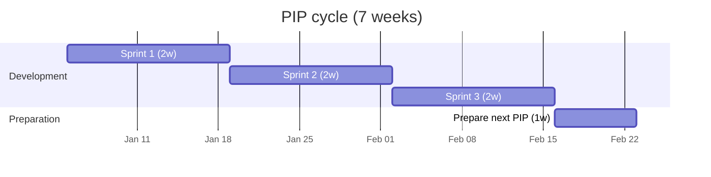
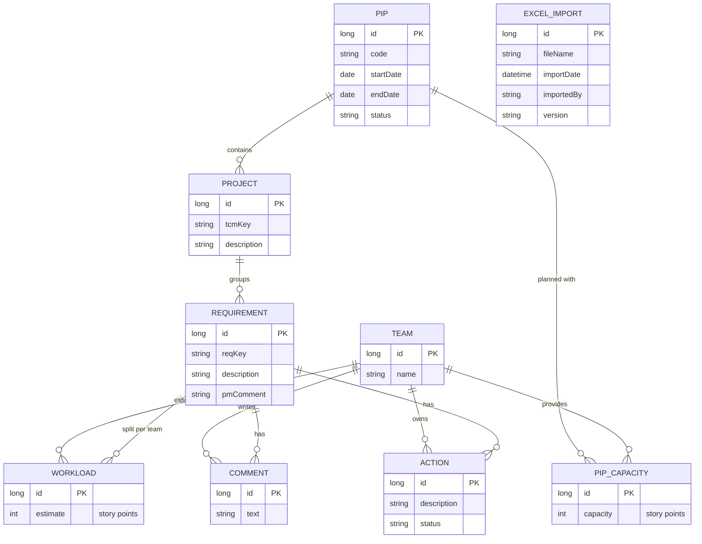
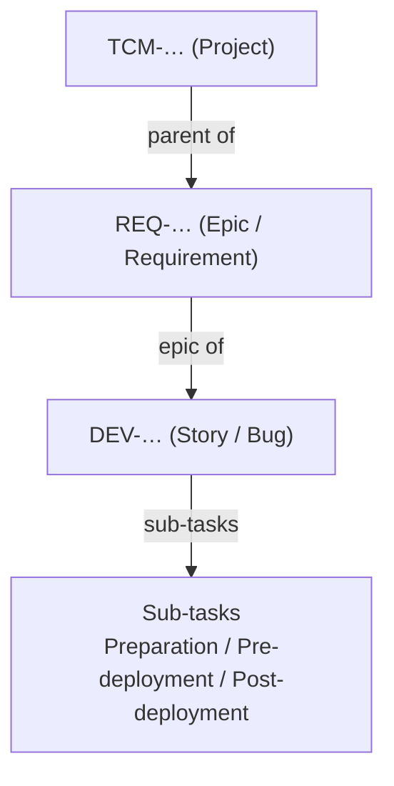
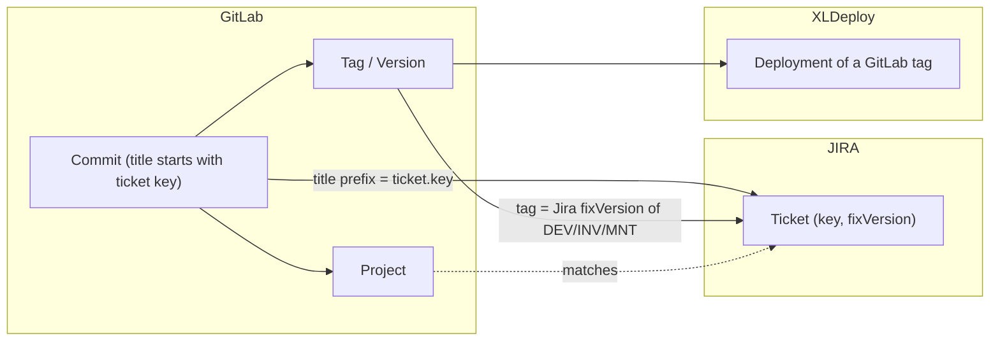
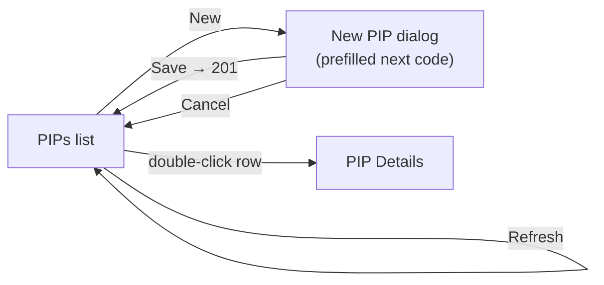
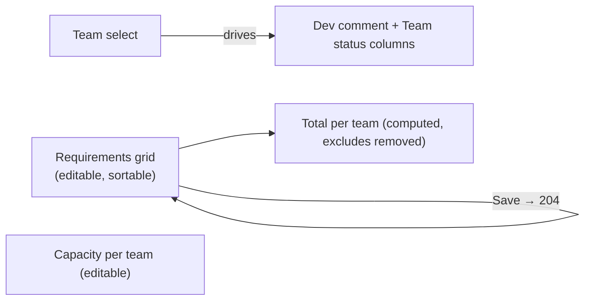
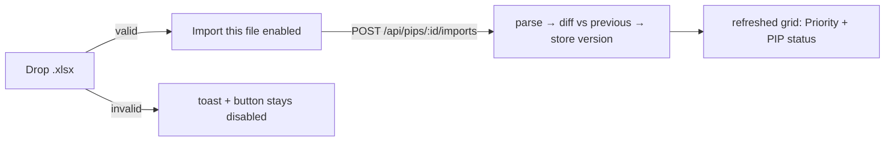

# Functional Documentation — PIP Assistant

> Keep this document updated after every functional change.

## Purpose

PIP Assistant supports Scrum Masters in preparing the backlog for the next **PIP**.

A **PIP** is a 7-week cycle: 6 weeks of development (3 sprints) followed by 1 week
dedicated to preparing the next PIP.

To prepare a PIP, Project Managers send development a regularly-updated **Excel file**
listing the next PIP's projects. Each row contains:

- the **TCM** (project) and its description;
- the **REQ** (requirement) and its description;
- a **comment** column;
- the known **workload per team**: Core, Portal, Process, Assets, API, Document.

## Goals

1. Identify requirements in JIRA together with their development tickets.
2. Track successive updates of the Excel planning file.
3. Manage comments and required actions per team and per REQ.

## Domain model (target)

Entities entered via the app and how they relate. Primary keys are technical `id`s.

`ExcelImport` records one entry per update of the PM Excel file (used to track how the
plan evolves across the preparation week).

Data **synced from external systems** (not edited in the app): `Ticket`, `Developer`,
`Version`, `Release`.

## JIRA status synchronisation

The `status` of each `Requirement` is read from JIRA (field `status.name` of the REQ
ticket) and persisted in the database. It is **not editable** in the application. Sync is
triggered:

1. **On page load** (PIP Detail screen): cached statuses are displayed immediately; the
   sync runs in the background and refreshes the grid when complete.
2. **On Excel import**: the backend syncs all REQs of the PIP after parsing the file, so
   the response already contains up-to-date statuses.
3. **On demand**: via the "Synchronize JIRA" button in the PIP Detail toolbar.

Errors (JIRA unavailable, ticket not found) are reported per-REQ and shown as a transient
toast (Snackbar). The last known status remains visible when JIRA is unreachable.

**Deep links**: double-clicking a REQ or TCM key in the grid opens the corresponding JIRA
ticket in a new tab. The JIRA base URL is configured server-side (`pip.jira.base-url`) and
included in the API response (`reqUrl`, `tcmUrl` on each requirement row).

## JIRA ticket categories

Categories correspond to "Projects" in JIRA and define the key prefix — every ticket
key starts with its category (e.g. `DEV-512`, `MNT-5155`, `TCM-120`).

| Category | Role | Delivery method | Epic | Parent | Key prefix |
|----------|------|-----------------|------|--------|------------|
| DEV | Development | Project, IT only | Epic (REQ) | — | `DEV-` |
| MNT | Maintenance | Continuous Improvement | Epic (MNT) | — | `MNT-` |
| INV | Investigation | Continuous Improvement | — | — | `DEV-` |
| REQ | Requirement | (always Project) | — | TCM | `REQ-` |
| TCM | Project | (always Project) | — | — | `TCM-` |
| REL | Release | — | — | — | fix version `yyyy-nnn` |

### Project ticket hierarchy

## Cross-source links

- **JIRA ↔ GitLab**: a commit links to a ticket when `commit.title` starts with the
  ticket key.
- **GitLab ↔ XLDeploy**: a GitLab tag is deployed via XLDeploy; that tag is also the
  fix version of DEV, INV and MNT tickets in JIRA.
- **GitLab**: each commit belongs to a version and a GitLab project; the GitLab project
  matches the ticket's `component`. A version may be added to a release.

## Features

### PIP list (`/pips`)

The first screen lists PIPs and lets the user create one.

- **Title**: "PIPs".
- **Year filter** (`mat-select`): the distinct 2-digit years present, plus **All**
  (default). Pressing **Refresh** reloads the list for the selected year.
- **New**: opens a dialog with an editable **PIP name** field, prefilled with the
  suggested next code, plus **Save** / **Cancel**.
- **List**: a table with **PIP name** and **Status** (badge), sorted descending;
  **double-clicking** a row opens the PIP Details page.

**Naming rule** — a PIP name is `yy_PIP_n` (2-digit year, then a sequence number), e.g.
`26_PIP_1`. The number is compared numerically (`26_PIP_10` > `26_PIP_9`).

**Next-code suggestion** — the greatest existing code with its sequence incremented
(`26_PIP_4` → `26_PIP_5`); the year is **not** changed automatically (edit it by hand when
a new year starts). With no PIP yet, the suggestion is `<current year>_PIP_1`.

**Status lifecycle** — `PREPARATION` (default at creation) → `ACTIVE` → `CLOSED`. Status
and dates are not editable on this screen yet.

Validation: an invalid format is rejected (400) and a duplicate name is rejected (409),
both surfaced as errors in the dialog.

### PIP Details (`/pips/:id`)

Opened by double-clicking a PIP. Title "PIP Details". Shows the PIP **name** and
**status** (read-only) and a worksheet of the PIP's requirements.

- **Requirements table** — one row per requirement, columns: **TCM**, **TCM description**,
  **REQ**, **REQ description**, **REQ status**, **PM comment**, **Dev comment**, and one
  story-points column per team (**Core, Portal, Process, Assets, API, Document**). Every
  column is **sortable**. All cells are editable **except TCM and REQ** (read-only keys).
- **Team selector** — chooses which team's note is shown/edited in the **Dev comment**
  column (each requirement keeps a comment per team).
- **Footer rows** — **Total** = live sum of each team's story points over the
  requirements; **Capacity** = each team's editable capacity for the PIP.
- **Save** — a single button persists all edits at once (requirement fields, dev comments,
  workloads, capacities). Requirement statuses are validated against a **configurable list**
  (`application.yml`, default `TODO / IN_PROGRESS / DONE`); an unknown status is rejected (400).

Requirements come from the **Excel import** (below). The grid also shows read-only columns
derived from import or JIRA: **Priority** (first), **PIP status**, and **Team status** (from JIRA).

#### Team status column

When a team is selected, a **Team status** column (read-only, badge, before "Dev comment")
shows the computed JIRA status for that team on each requirement. When **All** is selected
the column shows a dash.

| Badge | Meaning |
|-------|---------|
| TA todo | A technical-analysis ticket is open / to be estimated / ready |
| TA ongoing | A technical-analysis ticket is in progress |
| To be estimated | At least one DEV ticket is to be estimated |
| Ready | All DEV tickets are ready for implementation |
| Done | All DEV tickets are completed |
| — | No data (no tickets, or all abandoned) |

#### JIRA-locked workload cells

When JIRA computes story points for a (REQ, team) pair, the workload cell is
**overwritten and locked** — it shows the JIRA total (ready-for-implementation SP only)
and is no longer editable. The lock is lifted automatically when the JIRA backlog for
that pair drops back to 0.

### Excel import (PIP Details)

Project Managers send a regularly-updated `.xlsx`. On the PIP Details screen a **drag &
drop zone** accepts a file (a new drop replaces the previous one); a non-`.xlsx` triggers a
one-line transient toast and leaves **Import this file** disabled. Clicking the button
parses and imports the file into the current PIP.

**Recognising REQ rows** — a row is a requirement when its REQ column contains a `REQ-xxx`
key; other rows (headers, blanks, comments) and extra columns are ignored. Mandatory fields
are **TCM key (`TCM-xxx`), TCM description, REQ description**; a REQ row missing one is still
imported but flagged (see PIP status). Column positions are configurable
(`pip.import.*`) since the file's header labels may differ (e.g. "REQ Title").

**Versioning** — versions are tracked **per PIP**. The first import is v1, each later one
increments (v2, v3…). Every version's parsed rows are stored as a snapshot (basis for the
diff and a future rollback).

**Priority** — recomputed at each import from the REQ order in the file (1 = first). It is
the default sort. Requirements removed from the PIP have no priority and sink to the bottom.

**Diff & PIP status** — each REQ (identified by its `REQ-xxx` key) is compared to the
previous version's snapshot:

| PIP status | Meaning | Row style |
|------------|---------|-----------|
| `New` | First appearance (all of v1; a REQ added later) | — |
| `Unchanged` | Same content and same priority | — |
| `Priority changed` | Same content, different priority | — |
| `Changed` | A content field changed (TCM/REQ desc, comment, file workloads) | — |
| `Removed from PIP` | In the previous version, gone from the new file; kept visible | light grey, excluded from totals |
| `Missing data in import file` | A mandatory field is absent | pale red |

**Workloads** — per-team story points are optional in the file. A user may edit a workload
in the grid; once edited it becomes a manual override that **later imports do not
overwrite** (the PM remains authoritative for descriptions and comments).

## Visual design (Regatta & Marina themes)

The two screens were re-skinned to the design hand-off (`PIP Assistant.dc.html`). The
interface copy is **English**; the hand-off's two visual directions are both implemented and
switchable at runtime via a **theme toggle** in the header bar:

- **Regatta** (default) — warm, retro-sporty: terracotta primary, tricolour 4 px stripe,
  Space Grotesk / DM Sans, 4–8 px radii.
- **Marina** — modern & structured: navy primary, flat 2 px stripe, Plus Jakarta Sans,
  8–12 px radii, softer shadows.

The choice is persisted in `localStorage`; only base tokens differ between directions, so
the layout and the semantic status colours stay identical.

- **App shell** — a coloured header bar (logo `P`, wordmark, nav `PIPs / Imports / Teams /
  Settings`, theme toggle, "Scrum Master" + avatar) over the stripe; content centred at
  `1340 px`.
- **PIP list** — title + subtitle, toolbar (year filter, *Refresh*, *+ New PIP*), card table
  with status badges and an *Open ›* action, "Period" column (shows *To be scheduled* until
  PIP dates are captured). New-PIP dialog restyled (mono input, hint, validation).
- **PIP detail** — breadcrumb, title + status badge, team selector + *Save* (toggles to
  *Saved ✓*), three summary cards (Requirements, Projects TCM, Load / Capacity with red
  over-capacity), restyled drag-&-drop import zone, the six-status diff legend, and the
  requirements grid with a grouped super-header (*Requirements* / *Load per team (SP)*),
  per-status row colours, badge-styled REQ status select, and red Total/Capacity figures on
  over-capacity.

Status colours (PIP `PREPARATION/ACTIVE/CLOSED`, REQ `TODO/IN_PROGRESS/DONE`, and the six
import-diff states) are theme tokens shared by both screens and both directions.

### JIRA backlog sync

The app silently synchronises each REQ's JIRA backlog in the background:

- **At page load** — a sync fires immediately when PIP Details opens.
- **Every 10 minutes** — an Angular `interval()` triggers a new sync.
- **After user interaction** — any click or keystroke triggers a sync if more than 60
  seconds have elapsed since the last one (threshold configurable in `application.yml`).

A **"Last synced: HH:mm"** label (next to the Save button) appears once the first
sync completes.

The backend guards against JIRA overload with a **10-minute TTL** per PIP: a second
request within the window is silently ignored. The counters reset on server restart.

**What is synced per REQ:**

1. The REQ's JIRA status is fetched and stored (drives the REQ status field).
2. Child DEV stories are fetched (JQL: `issueType=Story AND "Epic Link"={reqKey}`).
3. The `BacklogCalculator` domain service produces SP totals and Team Status per team,
   using only tickets whose delivery method is `"project"` and whose team field maps
   to a known system team (both configurable in `pip.jira`).

**JIRA-sourced workloads replace manual values** — when JIRA computes SP > 0 for a
(REQ, team), the workload cell is overwritten (`jira_locked = true`). When the JIRA
backlog drops to 0 the cell is unlocked and future Excel imports may overwrite it again.

### Team scope & "TBD" workloads

The **Team** selector (PIP detail) drives more than the Dev-comment column:

- **All** (default) — the three summary cards show global figures (all requirements, all
  distinct TCMs, total load / total capacity).
- **A team selected** — the cards narrow to that team: only the requirements that **impact**
  it, the distinct TCMs among them, and that team's load / capacity. A requirement impacts a
  team when its cell for that team holds a value (including `0`) or **`TBD`**.

A team cell now accepts **`TBD`** ("To Be Defined"): the team is impacted by the requirement
but the story-point estimate is not known yet. `TBD` counts as 0 in the load totals, is a
manual edit (so later imports do not overwrite it), and persists across reloads.
