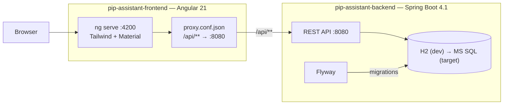
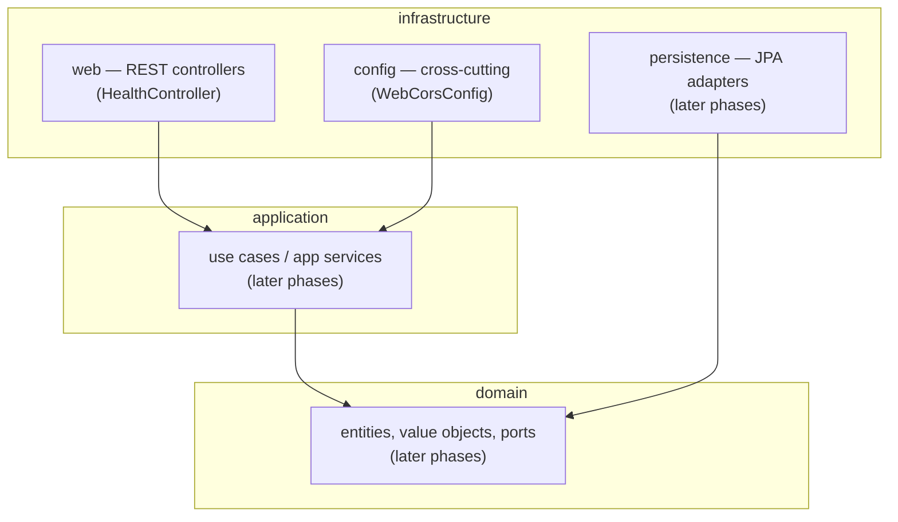
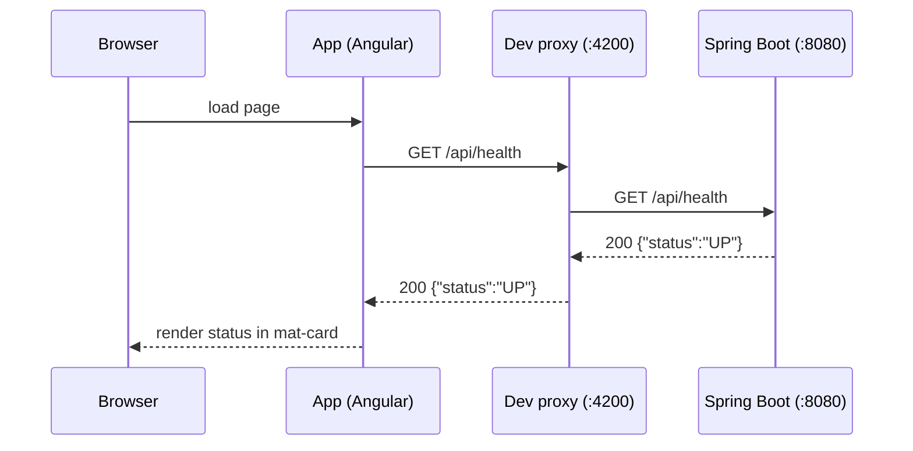
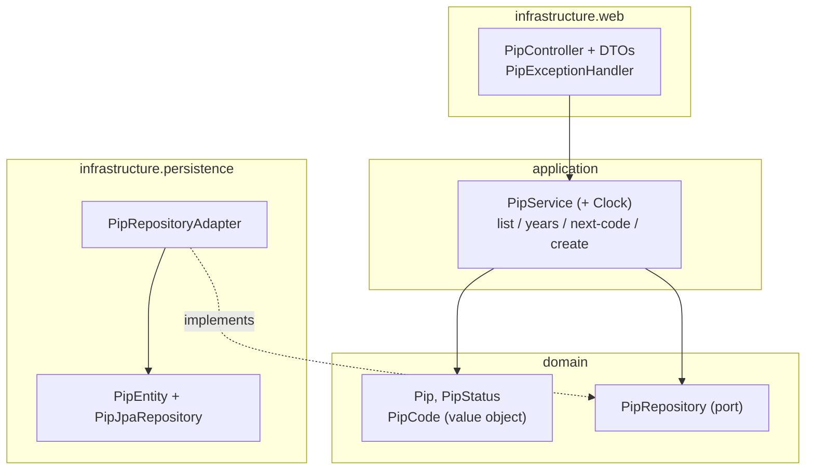
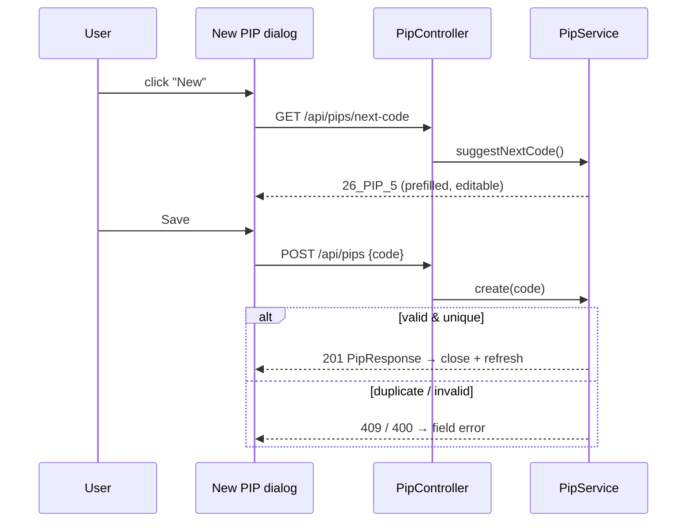
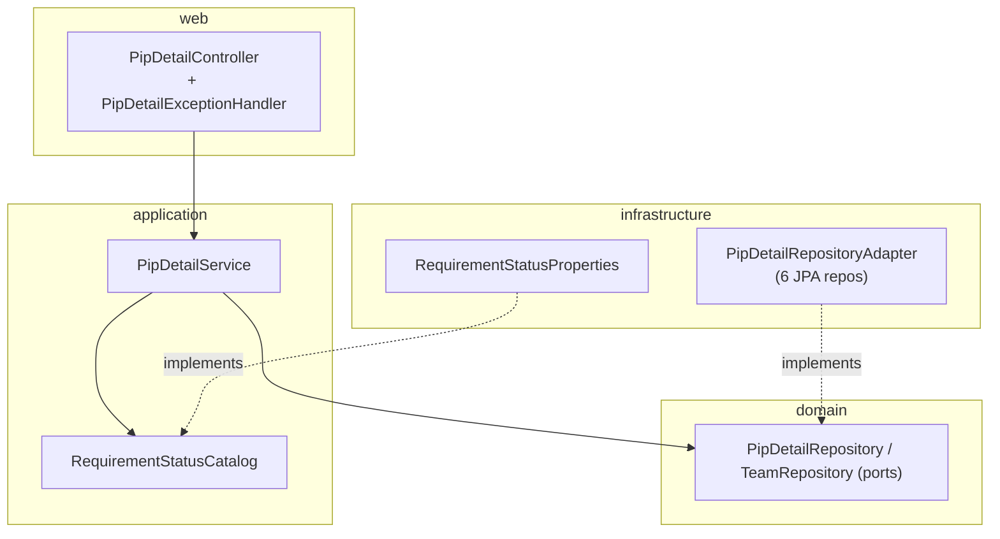
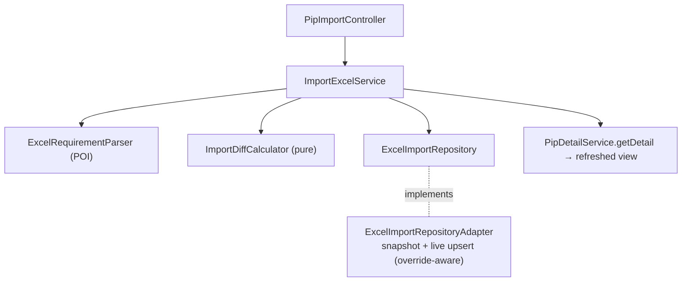

# Technical Documentation — PIP Assistant

> Keep this document updated after every technical change.

## Architecture overview

Monorepo with two independently buildable projects: an Angular frontend and a Spring
Boot backend. In development the Angular dev server proxies `/api` calls to the backend.



### Hexagonal layers (backend)



Packages under `com.utmost.lu.pipassistant`: `domain`, `application`, `infrastructure`.
In Phase 1 `domain` and `application` are empty; `infrastructure.web` and
`infrastructure.config` hold the only code.

## Health round-trip (Phase 1 end-to-end)



## Backend

- **Build/runtime**: `mvnw` wrapper; targets Java 21 (`<java.version>21</java.version>`),
  compiled/tested with Amazon Corretto 21 (`C:\Program Files\Amazon Corretto\jdk21.0.11_10`).
- **Persistence**: Spring Data JPA. Dev DB is H2 in-memory; schema owned by **Flyway**
  (`src/main/resources/db/migration`, starting at `V1__init.sql`). Hibernate
  `ddl-auto=none`. Target DB: **MS SQL Server** — keep migrations and types portable.
- **Configuration**: `src/main/resources/application.yml` (datasource, JPA, Flyway,
  Actuator). Secrets/URLs for integrations will come from env vars / non-committed files.
- **Endpoints (Phase 1)**: `GET /api/health` → `{"status":"UP"}` (plus Actuator at
  `/actuator/health`).
- **Tests**: JUnit 5. `PipAssistantBackendApplicationTests` (context loads),
  `HealthControllerTest` (`@WebMvcTest`). Note Spring Boot 4 moved test-slice annotations,
  e.g. `@WebMvcTest` is now in `org.springframework.boot.webmvc.test.autoconfigure`.

## Frontend

- **Tooling**: Angular CLI 21, `@angular/build` (esbuild). Tailwind 4 via PostCSS
  (`.postcssrc.json`, `@import 'tailwindcss'` in `src/styles.css`). Material theme in
  `src/material-theme.scss`.
- **HTTP**: `provideHttpClient(withFetch())` in `app.config.ts`; `HealthService` calls
  `/api/health`.
- **Dev proxy**: `src/proxy.conf.json` maps `/api/**` → `http://localhost:8080`,
  referenced from `angular.json` (`serve.options.proxyConfig`).
- **Tests**: Vitest via the `@angular/build:unit-test` builder (`npx ng test --watch=false`).

## Local development

| Action | Command |
|--------|---------|
| Backend tests | `cd pip-assistant-backend && ./mvnw test` |
| Backend run | `cd pip-assistant-backend && ./mvnw spring-boot:run` |
| Frontend install | `cd pip-assistant-frontend && npm install` |
| Frontend run | `cd pip-assistant-frontend && npm start` |
| Frontend build | `cd pip-assistant-frontend && npm run build` |
| Frontend tests | `cd pip-assistant-frontend && npx ng test --watch=false` |

IntelliJ: open the repo root, let it import the `pip-assistant-backend` Maven project,
then use the shared run configs (`Backend (Spring Boot)`, `Frontend (npm start)`, and the
`PIP Assistant (Full Stack)` compound). Point the Project SDK at Amazon Corretto 21.

CORS: the backend allows `http://localhost:4200` (`WebCorsConfig`) for direct calls;
the dev proxy is the primary mechanism during development.

## PIP vertical slice (reference pattern)

The first business feature (`Pip`) establishes the hexagonal pattern reused by future
entities.



- **`PipCode`** (domain value object) centralizes the naming rules: validation of
  `yy_PIP_n`, parsing of year/sequence, ordering, and next-code computation.
- **`PipService`** depends only on the `PipRepository` port and an injected `Clock`
  (testable time). `PipRepositoryAdapter` maps the port onto Spring Data JPA.
- Errors: `DuplicatePipCodeException` → 409, invalid code (`IllegalArgumentException`
  from `PipCode`) → 400, via `PipExceptionHandler`.
- Schema: Flyway `V2__create_pip.sql` (table `pip`, unique `code`).

### Endpoints

| Method | Path | Description |
|--------|------|-------------|
| GET | `/api/pips?year={yy}` | List PIPs (desc), optional 2-digit year filter |
| GET | `/api/pips/years` | Distinct 2-digit years present |
| GET | `/api/pips/next-code` | Suggested code for a new PIP |
| POST | `/api/pips` | Create a PIP (`{ "code": "26_PIP_1" }`) → 201 / 400 / 409 |



### Frontend structure

`src/app/app.ts` is a shell (`mat-toolbar` + `<router-outlet>`); routes: `'' → pips`,
`pips` → `PipList`, `pips/:id` → `PipDetail`. Feature code lives under `src/app/pips/`
(`pip.model.ts`, `pip.service.ts`, `pip-list/`, `pip-new-dialog/`, `pip-detail/`).

## PIP Details slice

Adds most of the domain (`Team`, `Project`, `Requirement`, `Workload`, `DevComment`,
`PipCapacity`) with an aggregated read and a single bulk save (`V3__create_pip_detail.sql`,
which also seeds the 6 teams).

- **Domain**: plain records + coarse ports `PipDetailRepository` (projects/requirements/
  workloads/dev-comments/capacities + upserts + interim `createRequirement`) and
  `TeamRepository`. Allowed requirement statuses come from `RequirementStatusCatalog`
  (application port) implemented by `RequirementStatusProperties`
  (`@ConfigurationProperties("pip.requirement")`, see `application.yml`).
- **Application**: `PipDetailService.getDetail` assembles `PipDetailView` (rows carry
  workloads + dev comments **per team**); `save` validates statuses then upserts; 404
  (`PipNotFoundException`) / 400 (`InvalidRequirementStatusException`).
- **Infrastructure**: per-table JPA entities + Spring Data repos composed by
  `PipDetailRepositoryAdapter`; `PipDetailController` + DTOs; `PipDetailExceptionHandler`.

### Endpoints

| Method | Path | Description |
|--------|------|-------------|
| GET | `/api/pips/{id}/detail` | Aggregated detail (pip, teams, requirement rows, capacities) |
| PUT | `/api/pips/{id}/detail` | Bulk save (requirement edits + capacities) → 204 / 400 / 404 |
| GET | `/api/requirement-statuses` | Configurable status list |
| POST | `/api/pips/{id}/requirements` | Interim create (tests / future import; not in UI) |



The frontend `pip-detail/` component loads the aggregate, edits cells in place (plain
inputs/select in a `mat-table` with `MatSort`; `Total`/`Capacity` as two `mat-footer-row`s),
tracks a dirty flag and persists everything via one PUT.

## Excel import slice

Drag & drop import of the PM `.xlsx` on PIP Details (Slice 1: import + diff; version
history viewer and rollback are Slice 2). Reuses the hexagonal pattern.

- **Domain**: `RequirementPipStatus` enum; records `ParsedRequirement`,
  `SnapshotRequirement`, `DiffedRequirement`, `ImportDiff`; ports `ExcelRequirementParser`
  and `ExcelImportRepository`; pure `domain.service.ImportDiffCalculator` (priority + status
  from parsed-vs-previous-snapshot, no I/O). `Requirement` gains `priority` + `pipStatus`.
- **Application**: `ImportExcelService.importFile` orchestrates parse → diff → persist →
  return the refreshed `PipDetailView`. Invalid file → `InvalidExcelFileException`.
- **Infrastructure**: `PoiExcelRequirementParser` (Apache POI `WorkbookFactory`, columns by
  configured position, `TCM-\d+`/`REQ-\d+` regex); `ExcelImportRepositoryAdapter` stores the
  raw snapshot (`excel_import`, `imported_requirement`, `imported_workload`) and updates the
  live requirement/workload tables, honouring `workload.manual_override`;
  `PipImportController` (multipart) + `PipImportExceptionHandler` (404 / 422). Layout from
  `ExcelImportProperties` (`@ConfigurationProperties("pip.import")`). Schema: Flyway `V4`.

The manual-override flag is set on the bulk Save path (`PipDetailRepositoryAdapter.upsertWorkload`
flips it when a value changes); imports skip overridden cells. `PipDetailService.getDetail`
sorts by priority with removed requirements last.

### Endpoints

| Method | Path | Description |
|--------|------|-------------|
| POST | `/api/pips/{id}/imports` | Import a planning `.xlsx` (multipart `file`) → refreshed detail / 404 / 422 |



## Test data tooling

The Claude Code project skill `.claude/skills/generate-test-excel/` generates a coherent
PIP planning `.xlsx` fixture — the file Project Managers send to development (one row per
REQ: `TCM`, `TCM Description`, `REQ`, `REQ Description`, `Comment`, plus one story-point
column per seeded team). It is a self-contained Node script (`exceljs`), independent of the
backend and frontend builds.

```
cd .claude/skills/generate-test-excel
npm install
node generate.js --versions 2 --seed 42   # → <repo>/test-data/26_PIP_1_v1.xlsx (+ _v2.xlsx)
```

A fixed `--seed` is reproducible; `--versions 2` also emits a v2 delta (stable keys, added/
re-estimated/dropped rows) to exercise the future Excel-import update tracking. Output lands
in the git-ignored `test-data/` directory. See the skill's `SKILL.md` for all options.

## Planned (later phases)

- Spring Security + JWT, CORS hardening.
- Excel import Slice 2: version history viewer + rollback (snapshots already stored).
- PIP detail enhancements (status/date editing), OpenAPI, status-admin screen.
- Integrations: GitLab REST API v4, JIRA REST API, XLDeploy REST API.

## Frontend theming (Regatta design)

The design hand-off (`PIP Assistant.dc.html`, imported via the Claude Design connector) is a
visual reference, not production code; the two screens were recreated with the existing
Angular + Material stack.

- **Tokens** — the "Regatta" palette/typography/density is exposed as CSS custom properties
  on `:root` in `src/styles.css`, alongside shared classes (`.page`, `.card`, `.btn`,
  `.badge`, `.field`, `.note`) and the semantic status/diff colour variables. Fonts
  (Space Grotesk / DM Sans / IBM Plex Mono) are loaded in `index.html`.
- **App shell** — `App` renders the header bar + stripe (`app.html` / `app.css`); the
  `mat-toolbar` was removed.
- **List / detail / dialog** — native themed controls replace most `mat-button` /
  `mat-form-field` usages for pixel fidelity. The detail grid keeps `mat-table` + `MatSort`
  (sort, two footer rows) with a second grouped header row (`groupReq` colspan 9 /
  `groupLoad` colspan = team count) and Material cell padding overridden to the token grid;
  the New-PIP dialog keeps `MatDialogRef` mechanics with a custom panel
  (`panelClass: pip-dialog-panel`, surface padding reset globally).
- No business logic moved to the client: totals, counts, over-capacity flags and the period
  placeholder are presentation-only; `PipResponse` still omits dates (period shows
  *À planifier*).
