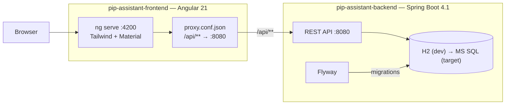
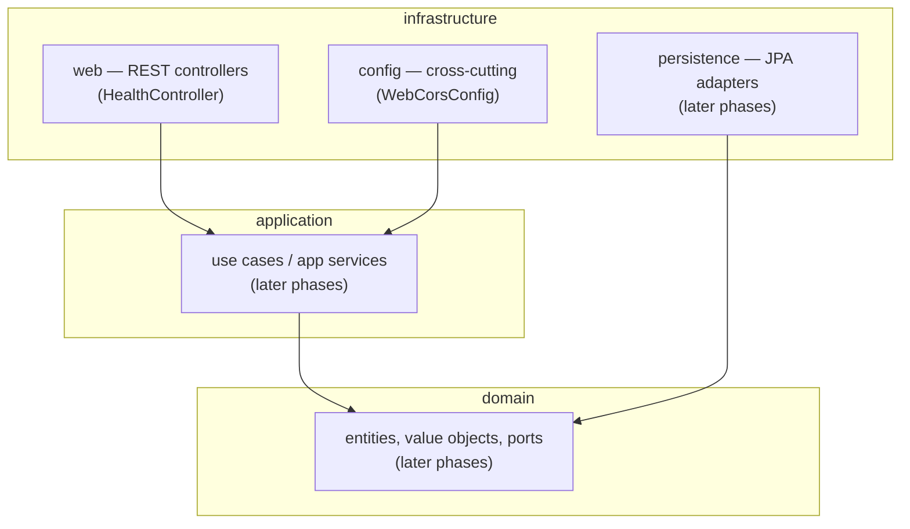
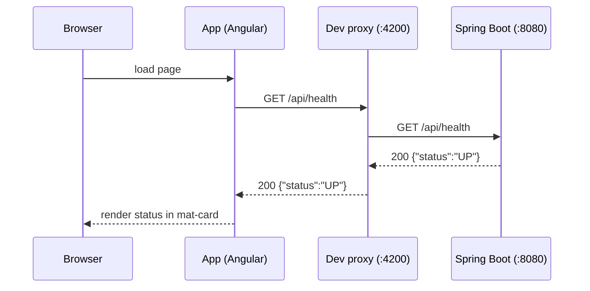

# Technical Documentation — PIP Assistant

> Keep this document updated after every technical change.

## Architecture overview

Monorepo with two independently buildable projects: an Angular frontend and a Spring
Boot backend. In development the Angular dev server proxies `/api` calls to the backend.

### Hexagonal layers (backend)

Packages under `com.utmost.lu.pipassistant`: `domain`, `application`, `infrastructure`.
In Phase 1 `domain` and `application` are empty; `infrastructure.web` and
`infrastructure.config` hold the only code.

## Health round-trip (Phase 1 end-to-end)

## Backend

- **Build/runtime**: `mvnw` wrapper; targets Java 21 (`<java.version>21</java.version>`),
  compiled/tested with Amazon Corretto 21 (`C:\Program Files\Amazon Corretto\jdk21.0.11_10`).
- **Persistence**: Spring Data JPA. Dev DB is H2 in-memory; schema owned by **Flyway**
  (`src/main/resources/db/migration`, starting at `V1__init.sql`). Hibernate
  `ddl-auto=none`. Target DB: **MS SQL Server** — keep migrations and types portable.
- **Configuration**: `src/main/resources/application.yml` (datasource, JPA, Flyway,
  Actuator). Secrets/URLs for integrations will come from env vars / non-committed files.
- **Endpoints (Phase 1)**: `GET /api/health` → `{"status":"UP"}` (plus Actuator at
  `/actuator/health`).
- **Tests**: JUnit 5. `PipAssistantBackendApplicationTests` (context loads),
  `HealthControllerTest` (`@WebMvcTest`). Note Spring Boot 4 moved test-slice annotations,
  e.g. `@WebMvcTest` is now in `org.springframework.boot.webmvc.test.autoconfigure`.

## Frontend

- **Tooling**: Angular CLI 21, `@angular/build` (esbuild). Tailwind 4 via PostCSS
  (`.postcssrc.json`, `@import 'tailwindcss'` in `src/styles.css`). Material theme in
  `src/material-theme.scss`.
- **HTTP**: `provideHttpClient(withFetch())` in `app.config.ts`; `HealthService` calls
  `/api/health`.
- **Dev proxy**: `src/proxy.conf.json` maps `/api/**` → `http://localhost:8080`,
  referenced from `angular.json` (`serve.options.proxyConfig`).
- **Tests**: Vitest via the `@angular/build:unit-test` builder (`npx ng test --watch=false`).

## Local development

| Action | Command |
|--------|---------|
| Backend tests | `cd pip-assistant-backend && ./mvnw test` |
| Backend run | `cd pip-assistant-backend && ./mvnw spring-boot:run` |
| Frontend install | `cd pip-assistant-frontend && npm install` |
| Frontend run | `cd pip-assistant-frontend && npm start` |
| Frontend build | `cd pip-assistant-frontend && npm run build` |
| Frontend tests | `cd pip-assistant-frontend && npx ng test --watch=false` |

IntelliJ: open the repo root, let it import the `pip-assistant-backend` Maven project,
then use the shared run configs (`Backend (Spring Boot)`, `Frontend (npm start)`, and the
`PIP Assistant (Full Stack)` compound). Point the Project SDK at Amazon Corretto 21.

CORS: the backend allows `http://localhost:4200` (`WebCorsConfig`) for direct calls;
the dev proxy is the primary mechanism during development.

## Planned (later phases)

- Spring Security + JWT, CORS hardening.
- Domain model + Flyway migrations (`V2__*`, ...) and full CRUD REST API + OpenAPI.
- Integrations: GitLab REST API v4, JIRA REST API, XLDeploy REST API.
- Excel import & change tracking.
